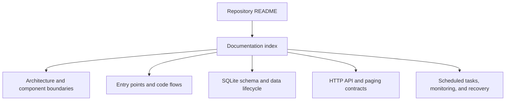

# Trombee Documentation

This directory explains how the xiakeng Trombee fork works at runtime and how to operate or extend it. The documentation follows behavior and entry points rather than mirroring the source tree class by class.

## Documentation Map

| Document | Purpose |
| --- | --- |
| [Architecture](architecture.md) | Components, dependencies, and the boundary between Jellyfin, Trombee services, and SQLite. |
| [Entry Points](entry-points.md) | Mermaid diagrams tracing every startup, task, event, page, and API entry point into the implementation. |
| [Storage](storage.md) | Schema resources, generation activation, schema hashing, incremental watermarks, and query indexes. |
| [API](api.md) | Authenticated routes, paging parameters, response contracts, and user/library visibility filtering. |
| [Operations](operations.md) | Configuration, task schedules, live monitoring, rebuild behavior, logs, backups, and recovery. |

## Documentation Contract

The completed guide set will:

- describe the deployed behavior represented by the current source, not a proposed future design;
- name the concrete classes and files responsible for every documented flow;
- use Mermaid diagrams for relationships, decisions, and asynchronous sequences;
- distinguish full rebuilds, scheduled incremental maintenance, and live event processing;
- explain why the active generation and previous valid generation are separate concepts;
- document user visibility filtering independently from index maintenance;
- keep installation and fork positioning in the repository [README](../README.md), with implementation details linked from there.

## Runtime Entry Points Covered

The entry-point guide covers these paths:

1. Plugin construction and page registration through `Plugin`.
2. Dependency injection and hosted-service registration through `PluginServiceRegistrator`.
3. Database startup through `ActorsIndexInitializationService`.
4. Initial-index recovery through `ActorsIndexBootstrapTask`.
5. Manual full rebuilds through `RebuildActorsIndexTask`.
6. Daily incremental maintenance through `UpdateActorsIndexTask`.
7. Debounced Jellyfin item events through `LibraryChangeMonitorService`.
8. Actor paging and filmography requests through `ActorsIndexController` and `ActorsIndexService`.
9. Settings and administrative maintenance actions through `configPage.html` and the controller.
10. Non-admin SPA registration through `PluginPagesRegistrationService`.

## Release Scope

This documentation update establishes source version `1.1.0.0`. After it reaches `main`, the existing auto-release workflow increments the fourth component, builds `1.1.0.1`, creates the release archive, computes its checksum, and prepends the installable entry to `manifest.json`.
