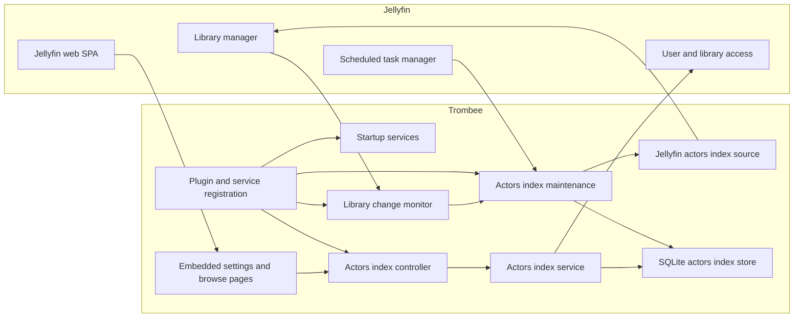
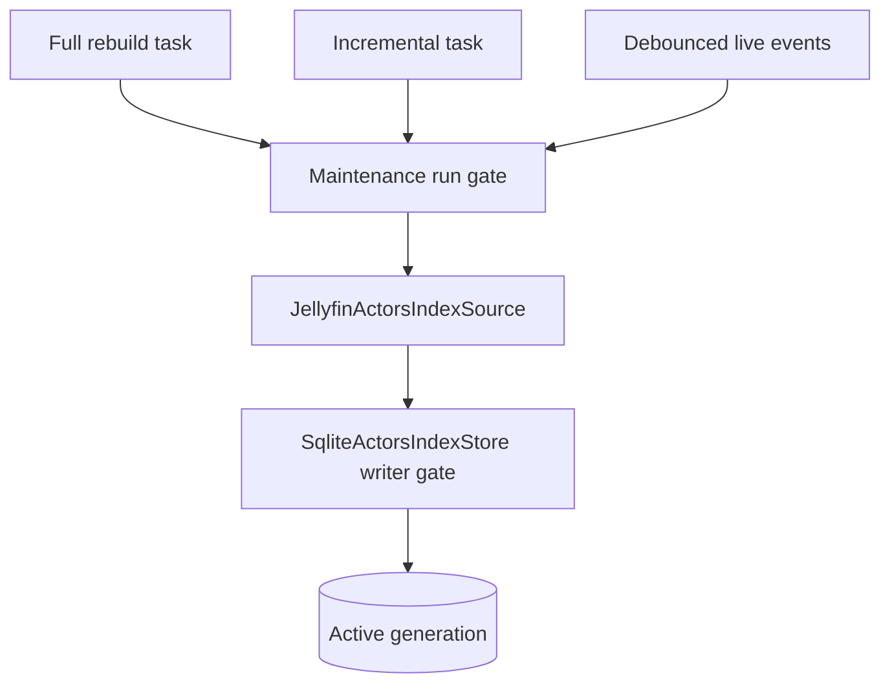

# Architecture

Trombee is a Jellyfin plugin with two distinct runtime paths:

- maintenance writes a durable actor index from Jellyfin library data;
- requests read the last active index and apply the calling user's current visibility rules.

No actor page request performs a full library scan.

## Component Map

## Responsibilities

| Component | Responsibility | Source |
| --- | --- | --- |
| Plugin metadata and pages | Exposes the settings page and actor browse page to Jellyfin. | [`Plugin.cs`](../Jellyfin.Plugin.ActorsIndex/Plugin.cs) |
| Dependency registration | Creates the SQLite store and registers services, hosted services, and tasks. | [`PluginServiceRegistrator.cs`](../Jellyfin.Plugin.ActorsIndex/PluginServiceRegistrator.cs) |
| Startup initialization | Creates or validates the database schema without blocking Jellyfin startup on failure. | [`ActorsIndexInitializationService.cs`](../Jellyfin.Plugin.ActorsIndex/Services/ActorsIndexInitializationService.cs) |
| Library adapter | Enumerates indexable movies, series, and episodes and converts Jellyfin people into stable credits. | [`JellyfinActorsIndexSource.cs`](../Jellyfin.Plugin.ActorsIndex/Services/JellyfinActorsIndexSource.cs) |
| Maintenance coordinator | Serializes full, incremental, and event-driven writes and reports task progress. | [`ActorsIndexMaintenanceService.cs`](../Jellyfin.Plugin.ActorsIndex/Services/ActorsIndexMaintenanceService.cs) |
| Durable store | Owns schema initialization, generations, transactions, paging queries, and watermarks. | [`SqliteActorsIndexStore.cs`](../Jellyfin.Plugin.ActorsIndex/Persistence/SqliteActorsIndexStore.cs) |
| Read service | Computes the calling user's visible source item IDs, then queries the active generation. | [`ActorsIndexService.cs`](../Jellyfin.Plugin.ActorsIndex/Services/ActorsIndexService.cs) |
| HTTP API | Validates route parameters, applies authorization, and returns paged JSON or admin operations. | [`ActorsIndexController.cs`](../Jellyfin.Plugin.ActorsIndex/Api/ActorsIndexController.cs) |
| Live monitor | Debounces Jellyfin item events and applies normalized changes to the active generation. | [`LibraryChangeMonitorService.cs`](../Jellyfin.Plugin.ActorsIndex/Services/LibraryChangeMonitorService.cs) |
| User-facing SPA | Manages actor paging, filters, history, responsive layout, and actor detail navigation. | [`actorsBrowse.html`](../Jellyfin.Plugin.ActorsIndex/Configuration/actorsBrowse.html) |

## Maintenance Boundary

All writes pass through one `SemaphoreSlim` in `ActorsIndexMaintenanceService`. A full rebuild, daily incremental run, and live event batch cannot modify the index concurrently.

The store also has separate initialization and writer gates. SQLite connections use WAL journaling, normal synchronous mode, foreign keys, and a five-second busy timeout.

## Read Boundary

Actor and filmography reads use only the active SQLite generation for indexed metadata. For authenticated users, `ActorsIndexService` obtains the source item IDs currently visible to that user and loads them into a temporary SQLite filter table for the query.

This distinction matters when live monitoring is disabled: the stored row is intentionally unchanged until incremental maintenance, but an item removed from Jellyfin can disappear from the page immediately because it is no longer in the caller's visible item set.

## Failure Model

- Schema initialization failures are logged and do not abort Jellyfin startup.
- A full rebuild writes a new `building` generation. The active generation is unchanged until activation succeeds.
- A failed or cancelled rebuild therefore leaves the previous completed generation readable.
- Incremental and live changes update only the active generation and run inside SQLite transactions.
- A missing active generation causes incremental maintenance to perform a full rebuild instead.

See [Entry Points](entry-points.md) for code-flow diagrams and [Storage](storage.md) for the generation and schema model.
