# Entry Points and Code Flows

This guide starts from every way Jellyfin or the web client enters Trombee and follows the call path to its side effects.

## 1. Plugin Construction and Embedded Pages

Jellyfin constructs `Plugin`, which stores the active plugin instance and exposes two embedded pages.

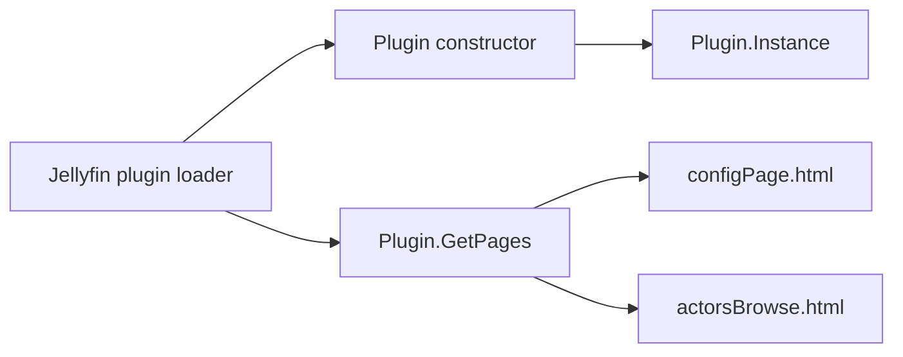

Source: [`Plugin.cs`](../Jellyfin.Plugin.ActorsIndex/Plugin.cs).

## 2. Dependency Registration

`PluginServiceRegistrator` defines the process-wide service graph.

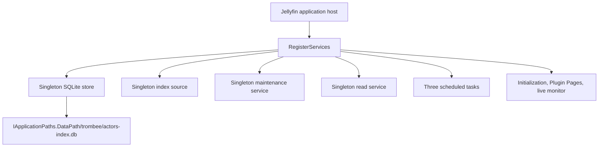

Source: [`PluginServiceRegistrator.cs`](../Jellyfin.Plugin.ActorsIndex/PluginServiceRegistrator.cs).

## 3. Database Startup and Schema Change

The hosted initialization service calls the idempotent store initializer. Schema resources are sorted, normalized, and hashed as one set.

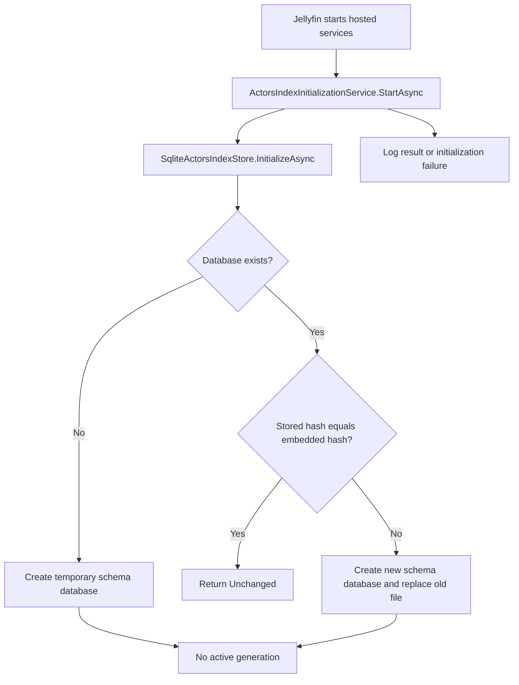

The hidden bootstrap task handles the empty active-generation state after scheduled tasks are registered.

Sources: [`ActorsIndexInitializationService.cs`](../Jellyfin.Plugin.ActorsIndex/Services/ActorsIndexInitializationService.cs), [`EmbeddedSqlResourceProvider.cs`](../Jellyfin.Plugin.ActorsIndex/Persistence/Sql/EmbeddedSqlResourceProvider.cs), and [`SqliteActorsIndexStore.cs`](../Jellyfin.Plugin.ActorsIndex/Persistence/SqliteActorsIndexStore.cs).

## 4. Hidden Startup Bootstrap

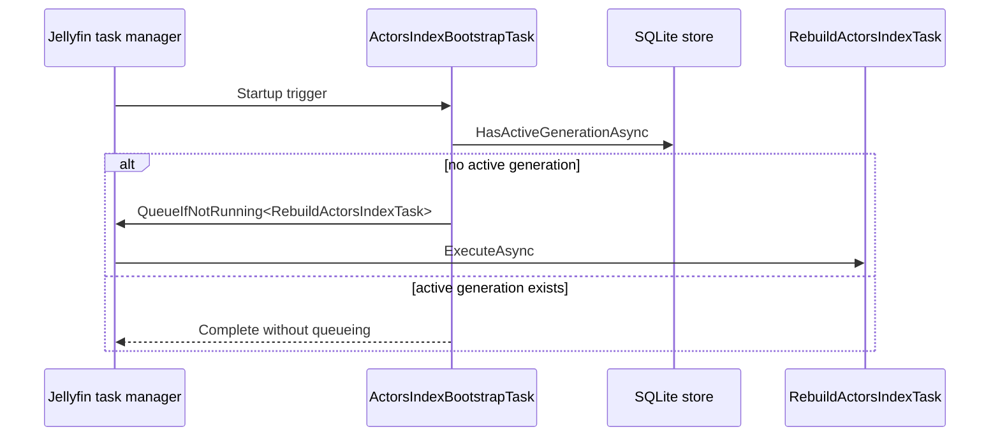

The task is hidden, enabled, logged, and triggered only at startup. Source: [`ActorsIndexBootstrapTask.cs`](../Jellyfin.Plugin.ActorsIndex/Tasks/ActorsIndexBootstrapTask.cs).

## 5. Manual Full Rebuild

The visible manual task has no default trigger.

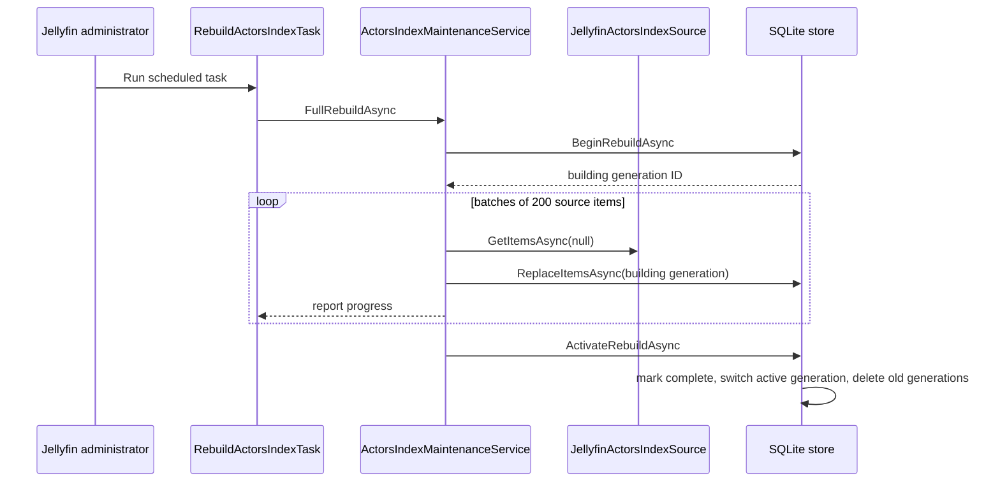

If enumeration, cancellation, or activation fails, the existing active generation is never replaced. Sources: [`RebuildActorsIndexTask.cs`](../Jellyfin.Plugin.ActorsIndex/Tasks/RebuildActorsIndexTask.cs) and [`ActorsIndexMaintenanceService.cs`](../Jellyfin.Plugin.ActorsIndex/Services/ActorsIndexMaintenanceService.cs).

## 6. Daily Incremental Maintenance

`UpdateActorsIndexTask` defaults to 03:00 daily.

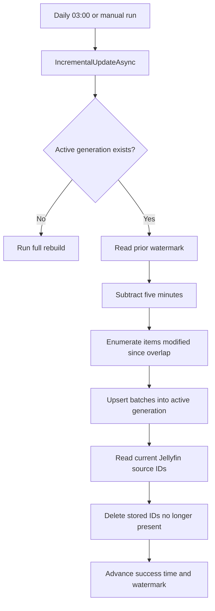

The overlap protects against timestamp precision and events near the previous run boundary. The watermark advances only after upserts and deletion reconciliation succeed. Sources: [`UpdateActorsIndexTask.cs`](../Jellyfin.Plugin.ActorsIndex/Tasks/UpdateActorsIndexTask.cs) and [`ActorsIndexMaintenanceService.cs`](../Jellyfin.Plugin.ActorsIndex/Services/ActorsIndexMaintenanceService.cs).

## 7. Live Library Monitoring

The monitor subscribes to movie, series, and episode add/update/remove events when the plugin and `MonitorLibraryChanges` setting are enabled.

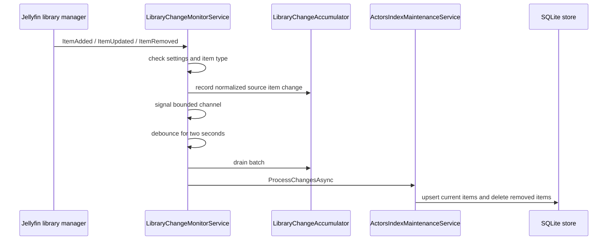

Removal wins when multiple event types for the same source item occur in one batch. Live batches do not advance the scheduled incremental watermark, so the daily task remains a reconciliation safety net. Sources: [`LibraryChangeMonitorService.cs`](../Jellyfin.Plugin.ActorsIndex/Services/LibraryChangeMonitorService.cs) and [`LibraryChangeAccumulator.cs`](../Jellyfin.Plugin.ActorsIndex/Services/LibraryChangeAccumulator.cs).

## 8. Actor Page and Actor Paging API

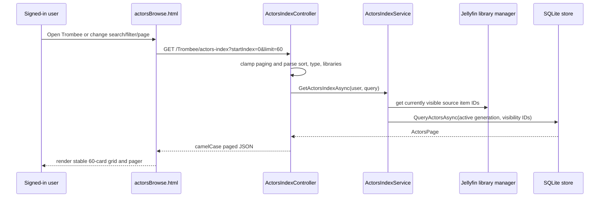

The SPA owns route/history behavior and responsive presentation. The controller and store own validation, authorization, filtering, sorting, and paging. Sources: [`actorsBrowse.html`](../Jellyfin.Plugin.ActorsIndex/Configuration/actorsBrowse.html), [`ActorsIndexController.cs`](../Jellyfin.Plugin.ActorsIndex/Api/ActorsIndexController.cs), and [`ActorsIndexService.cs`](../Jellyfin.Plugin.ActorsIndex/Services/ActorsIndexService.cs).

## 9. Filmography Request

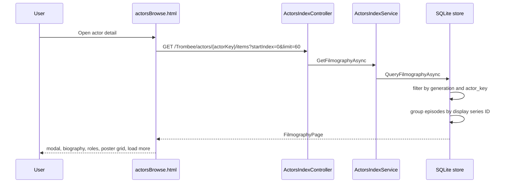

The credit index begins with `(generation_id, actor_key)`, matching the most selective filmography predicate. Episodes store their series as `display_item_id`, so a series appears once rather than once per episode.

## 10. Settings and Administrative Actions

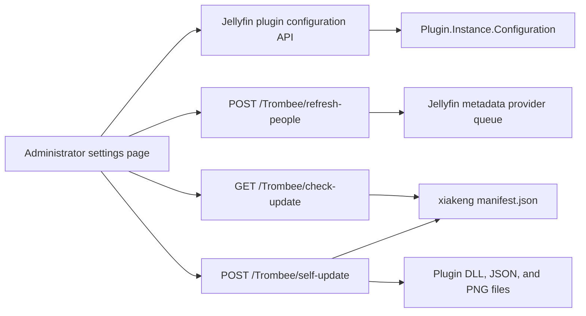

The controller requires Jellyfin elevation for image refresh and self-update operations. Image refresh queues a full metadata and image replacement for every Person item and is intentionally separate from actor index maintenance.

Sources: [`configPage.html`](../Jellyfin.Plugin.ActorsIndex/Configuration/configPage.html) and [`ActorsIndexController.cs`](../Jellyfin.Plugin.ActorsIndex/Api/ActorsIndexController.cs).

## 11. Plugin Pages Registration

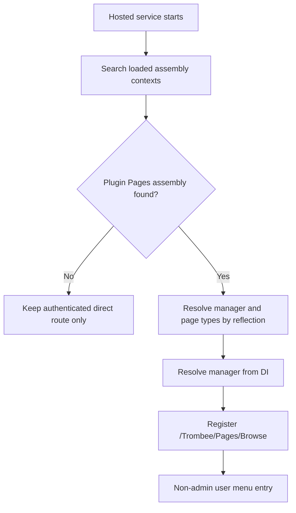

Reflection avoids a direct plugin dependency across isolated assembly load contexts. Source: [`PluginPagesRegistrationService.cs`](../Jellyfin.Plugin.ActorsIndex/Services/PluginPagesRegistrationService.cs).
