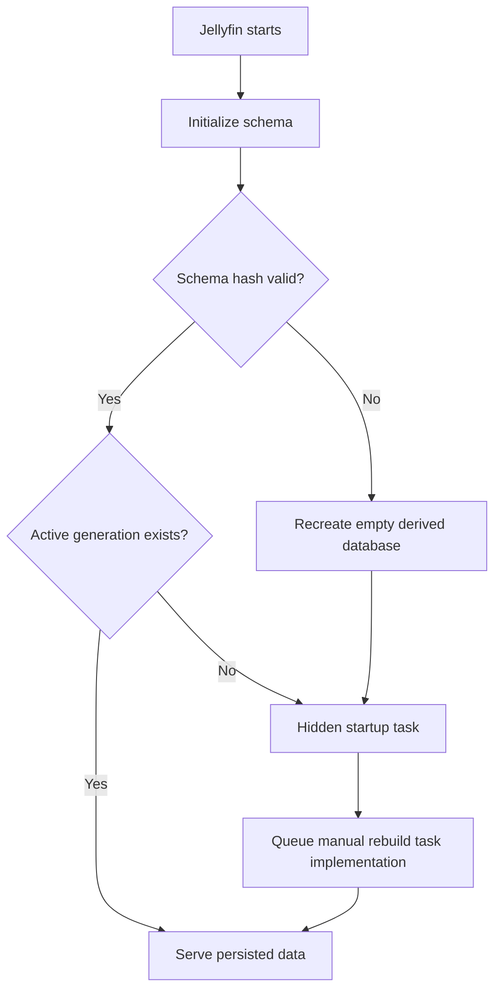

# Operations

## Configuration

| Setting | Default | Effect |
| --- | --- | --- |
| Enable plugin | On | Enables Trombee configuration and live-monitor decisions. |
| Minimum appearances | `1` | Hides people below the threshold at query time. |
| Show role name | On | Controls role display in the SPA. |
| Monitor library changes | On | Applies relevant Jellyfin item events to the active SQLite generation after a two-second debounce. |

Settings are stored by Jellyfin as plugin configuration. Turning monitoring off stops new live batches; the daily incremental task remains the reconciliation path.

## Scheduled Tasks

Trombee registers three Jellyfin tasks in category `Trombee`.

| Task | Visibility | Default trigger | Purpose |
| --- | --- | --- | --- |
| Initialize Trombee actor data | Hidden | Jellyfin startup | Queues a rebuild only when no active generation exists. |
| Update Trombee actor data | Visible | Daily at 03:00 | Upserts modified items, removes missing items, and advances the watermark. |
| Rebuild all Trombee actor data | Visible | None | Recreates all actor data in a new generation when run manually. |

Administrators can change Jellyfin's configured task schedule. The full rebuild intentionally has no automatic trigger.

## Startup Behavior



The hidden task is used because Jellyfin's startup hosted-service phase can precede scheduled-task worker registration. A native startup-triggered task runs after that registration without timing delays or polling.

## Monitoring Behavior

The monitor subscribes to `ItemAdded`, `ItemUpdated`, and `ItemRemoved` for movies, series, and episodes. It ignores other item types and disabled configuration.

Events are accumulated by source item ID. Removal takes precedence within a batch. A bounded signal channel collapses bursts, and the worker waits two seconds before draining the normalized batch.

Live writes do not advance the daily task watermark. This makes the daily task a correctness backstop rather than only a timer for systems with monitoring disabled.

### Visibility note

Monitoring controls persisted actor data, not Jellyfin authorization. Reads always intersect the index with the caller's currently visible Jellyfin items. With monitoring off, a deleted item may disappear from the page before its stale SQLite row is removed by the daily task.

## Full Rebuild Behavior

- A new building generation is created.
- Jellyfin items are converted and written in batches of 200.
- Progress is reported through the scheduled task.
- Only a complete generation can be atomically activated.
- Previous data remains readable during the scan.
- Failed or cancelled rebuilds do not replace the active generation.

## Logs

Useful messages include:

```text
Trombee actors-index schema initialization result: Created|Recreated|Unchanged
Starting Trombee actors-index generation {id}
Activated Trombee actors-index generation {id}
Trombee browse page registered with Plugin Pages successfully.
```

Live batch and initialization failures include the service name and exception in Jellyfin's normal server log.

## Backup and Recovery

The SQLite database is derived from Jellyfin and does not need to be included in a media metadata backup. Backing it up can shorten recovery time for a large library.

For a consistent file backup:

1. Stop Jellyfin.
2. Copy `actors-index.db` from `{DataPath}/trombee`.
3. If `actors-index.db-wal` or `actors-index.db-shm` exists, copy those sidecars with it.
4. Start Jellyfin.

To force recovery from Jellyfin data:

1. Stop Jellyfin.
2. Move the database and sidecars to a backup location.
3. Start Jellyfin.
4. Watch the hidden initialization task queue the full rebuild.

Do not replace a live SQLite main file independently from an active WAL.

## Actor Images

The actor grid reads Jellyfin Person primary images; Trombee does not download or cache image binaries in SQLite.

The **Refresh actor images** action is a repair tool. It queues a full metadata and image replacement for every Person item. On a large library it can create substantial provider traffic and overwrite curated Person metadata, so it should not be part of routine actor index maintenance.

## Troubleshooting

### Page reports no results

- Check the `Rebuild all Trombee actor data` task history.
- Check `service-status` for an active generation.
- Review schema initialization and rebuild log messages.
- Run the manual rebuild if the database has no active generation.

### Actor images are all broken

- Confirm the deployed plugin includes Person item ID resolution.
- Run a full actor-data rebuild after upgrading from an index that stored People row IDs.
- Test the Person image URL in Jellyfin before using the expensive refresh-all action.

### Changes are not immediate

- Confirm **Monitor library changes** is enabled.
- Confirm Jellyfin has recognized the filesystem change; Trombee reacts to Jellyfin item events, not raw filesystem notifications.
- Run `Update Trombee actor data` manually to test incremental reconciliation.

### Schema changed after an upgrade

A changed aggregate schema hash intentionally recreates the derived database. The hidden startup task then queues a full rebuild. The page remains empty until the first active generation is published because the old schema is not retained across an incompatible change.

### Plugin Pages menu item is missing

- The actor route remains available to authenticated users at `/Trombee/Pages/Browse`.
- Confirm File Transformation and Plugin Pages are installed and loaded.
- Restart Jellyfin after installing them.
- Look for `PluginPagesRegistrationService` messages in the server log.
