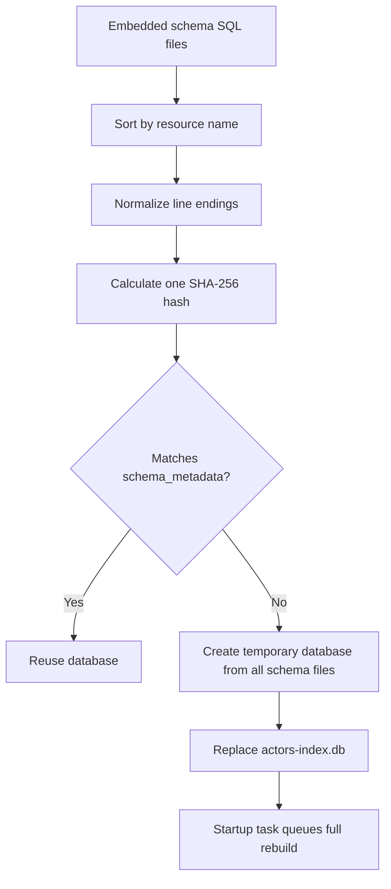
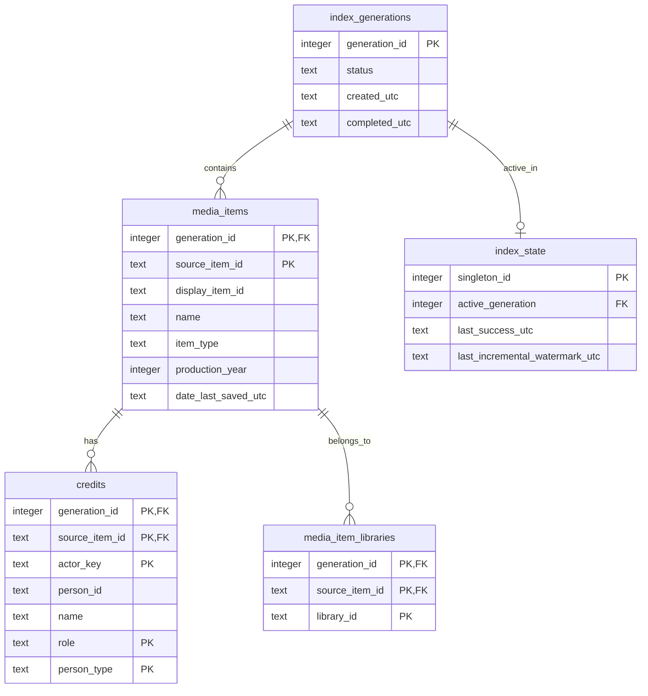
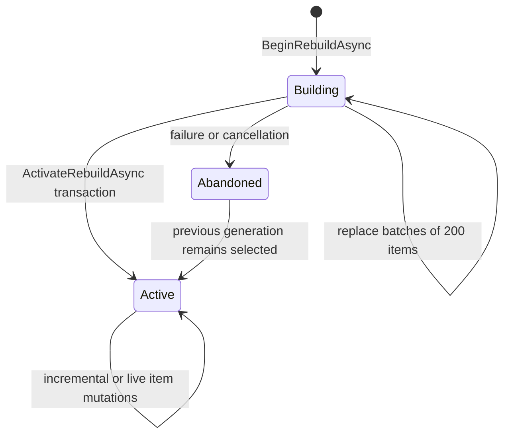

# SQLite Storage

Trombee stores derived actor data at:

```text
{Jellyfin DataPath}/trombee/actors-index.db
```

The database is disposable derived data. Jellyfin library metadata remains the source of truth.

## Schema Ownership

Table definitions, constraints, and related indexes live in per-table embedded resources under [`Persistence/Sql/Schemas`](../Jellyfin.Plugin.ActorsIndex/Persistence/Sql/Schemas). Complex paged reads live as separate resources under [`Persistence/Sql/Queries`](../Jellyfin.Plugin.ActorsIndex/Persistence/Sql/Queries).

`EmbeddedSqlResourceProvider` sorts all schema files by name, normalizes line endings, concatenates each filename and content, and calculates one SHA-256 hash for the complete schema set.



No migration history is maintained because the index can always be rebuilt from Jellyfin.

## Data Model



### Identifiers

- `source_item_id` is the movie, series, or episode being indexed.
- `display_item_id` is the item shown in filmography. For an episode, this is the parent series ID.
- `actor_key` is the stable grouping key. When Jellyfin resolves a Person item, its item ID is used; otherwise Trombee falls back to the stable People row ID.
- `person_id` is nullable and contains only a real Jellyfin Person item ID suitable for image and metadata routes.

## Generation Lifecycle

Only one completed generation is expected after activation. A second generation exists temporarily while a full rebuild is running.



Activation is one transaction that:

1. changes the building generation to `completed`;
2. updates `index_state.active_generation`, success time, and incremental watermark;
3. deletes every other generation;
4. commits before query planner optimization.

Readers therefore never select a partially populated generation.

## Incremental Watermark

The daily task records its start time only after all modified items and deletions are committed. Its next run queries Jellyfin from five minutes before that watermark.

Live event batches intentionally do not advance the watermark. The scheduled task can revisit live changes and reconcile anything missed during scans, restarts, or event bursts.

## Query Indexes

| Index | Key order | Supported access path |
| --- | --- | --- |
| `idx_credits_actor_query` | `generation_id, actor_key, person_type, source_item_id` | Filmography lookup by active generation and actor; credit type filtering. |
| `idx_media_item_libraries_filter` | `generation_id, library_id, source_item_id` | Selected-library existence checks. |
| `idx_media_items_display` | `generation_id, display_item_id` | Filmography grouping and display item joins. |

Actor pages aggregate credits after filtering by generation, person type, search term, selected libraries, and visible source items. Filmography begins with the selective `actor_key` predicate and groups by `display_item_id`.

## SQLite Runtime Settings

Each connection enables:

```sql
PRAGMA journal_mode = WAL;
PRAGMA synchronous = NORMAL;
PRAGMA foreign_keys = ON;
PRAGMA busy_timeout = 5000;
```

Foreign-key cascades remove credits and library links when a media item or generation is deleted. Store writes are serialized and transactional.

## Backup and Replacement

The safest backup is taken while Jellyfin is stopped. Copy `actors-index.db` and, if present, its `-wal` and `-shm` sidecars as one set. Restoring only the main file while a WAL is active can lose committed pages.

Because the file is derived data, deleting or moving it while Jellyfin is stopped is also a valid recovery action. At next startup, schema initialization creates an empty database and the hidden bootstrap task queues a full rebuild.
